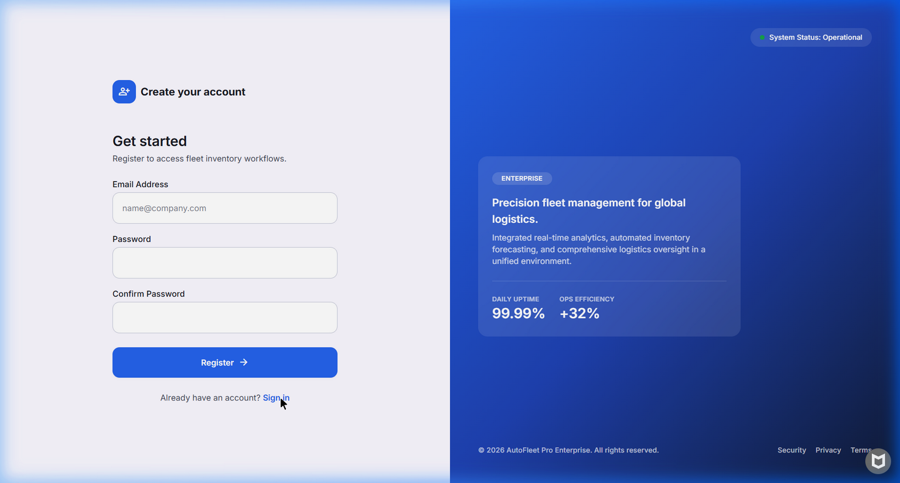
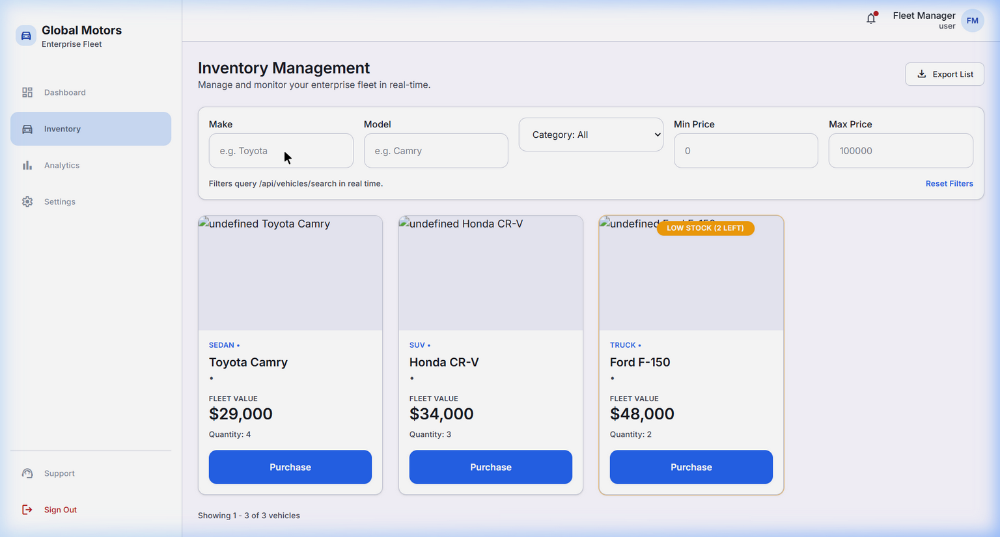
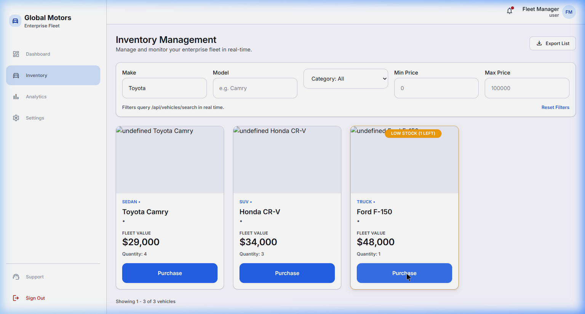
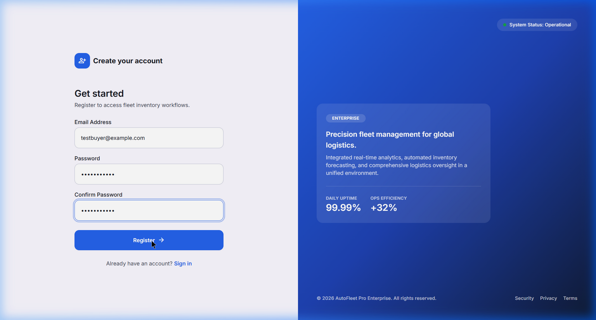

# DriveFlow — AutoFleet Pro (Car Dealership Inventory System)

## Project Overview

**DriveFlow (AutoFleet Pro)** is a modern, full-stack car dealership and fleet inventory management single-page application (SPA) and RESTful API. Designed to satisfy the requirements of the **TDD Kata: Car Dealership Inventory System**, DriveFlow enables automotive managers and dealership staff to track fleet metrics, manage vehicle records, execute stock purchases, handle restock inventory replenishment, and restrict administrative operations through role-based access control.

The system is built from a Google Stitch UI design export ("Precision Automate" design tokens) into a robust full-stack solution featuring a **Node.js/Express** backend connected via **Prisma ORM** to a persistent **SQLite** database, paired with a type-safe **React 18 + TypeScript + Vite + Tailwind CSS** frontend.

---

## Architecture Summary

DriveFlow follows a clean, modular architecture with strict separation of concerns:

- **Backend Architecture**: Node.js + Express.js adopting a Repository-Service-Controller pattern:
  - **Data Access Layer**: Prisma ORM interacting with a persistent SQLite database (`prisma/dev.db`).
  - **Service Layer**: Implements core domain logic (e.g., stock check before purchase, password hashing, inventory aggregation, pagination math).
  - **Controller Layer**: Handles HTTP requests, Zod input validation (`validate` middleware), rate limiting (`authRateLimiter`), and centralized error handling (`errorHandler`).
  - **Security & Authentication**: JSON Web Tokens (JWT) for stateless authentication, BCrypt for password hashing, and `express-rate-limit` for auth route protection. Role-based Access Control (RBAC) via custom middleware (`requireAuth`, `requireAdmin`).
- **Frontend Architecture**: Single Page Application (SPA) built with React 18, TypeScript, Vite, and Tailwind CSS:
  - **Routing & Layouts**: React Router v6 with protected routes and role-gated UI elements.
  - **State Management**: Custom React hooks (`useAuth`, `useVehicles`, `useFleetStats`) and Context API for global session state and toast notification banners.
  - **Design System**: Semantic Tailwind design tokens (`surface-container`, `primary`, `on-surface`) derived from Google Stitch design exports.

---

## Local Setup Instructions

Follow these steps to set up and run DriveFlow from a fresh repository clone.

### Prerequisites

- **Node.js**: v18.0.0 or higher
- **npm**: v9.0.0 or higher

### 1. Clone & Install Dependencies

Clone the repository and install root and workspace dependencies:

```bash
git clone <repository-url>
cd car-dealership-inventory

# Install root devDependencies (Vitest runner & workspace tools)
npm install

# Install backend dependencies
cd backend
npm install
cd ..

# Install frontend dependencies
cd frontend
npm install
cd ..
```

### 2. Environment Configuration

Copy the example environment file in the `backend/` directory:

```bash
cp backend/.env.example backend/.env
```

The default `.env` configuration contains:
```env
DATABASE_URL="file:./dev.db"
JWT_SECRET="test-jwt-secret"
```

### 3. Database Setup (Prisma Migration & Seed)

Initialize the SQLite database schema and seed it with mock vehicle inventory data:

```bash
cd backend
npm run prisma:migrate
npm run prisma:seed
cd ..
```

### 4. Running the Application

#### Start the Backend API Server
In one terminal window, start the Express backend server (listens on `http://localhost:4000`):

```bash
cd backend
npm start       # Production start
# OR
npm run dev     # Development mode with hot-reloading
```

#### Start the Frontend Development Server
In a second terminal window, start the Vite frontend server:

```bash
cd frontend
npm run dev
```

Open **http://localhost:5173** in your browser.

*Note: Pre-filled demo credentials are available on the login screen (`manager@globalmotors.com` / `demo1234`). You can also click "Register" to create a new user account.*

### 5. Running the Test Suite

Run the full unified backend and frontend test suite (46 tests across 13 test files) with a single command from the repository root:

```bash
npx vitest run
```

To run tests in watch mode during development:
```bash
npx vitest
```

---

## Application Screenshots









---

## Detailed Test Report

For complete test results, coverage breakdown by functional area, and terminal test execution logs, see the dedicated [TEST_REPORT.md](TEST_REPORT.md).

---

## My AI Usage

### AI Assistance Overview

Throughout the development of DriveFlow (AutoFleet Pro), an AI coding assistant was utilized as a collaborative pair programmer. The AI aided in generating initial API route skeletons, drafting unit/integration test cases, mapping Stitch design tokens to Tailwind CSS utilities, implementing production hardening features (Zod schemas, rate limiting, error middleware, pagination, CI workflow), and troubleshooting complex environment and configuration issues.

### TDD-First Backend & Production Upgrades Development

Development followed a strict Test-Driven Development (TDD) approach across every phase:
1. **Stage-by-Stage Implementation**: The AI was prompted to draft Vitest integration tests for API endpoints *before* writing the underlying controller and service implementations.
2. **Red-Green-Refactor Cycle**: Integration test files were created for authentication (`auth.integration.test.js`), vehicle CRUD operations (`vehicles.integration.test.js`), multi-field search (`search.integration.test.js`), purchase logic (`purchase.integration.test.js`), admin restocking (`restock.integration.test.js`), input validation (`validation.integration.test.js`), rate limiting (`rateLimit.integration.test.js`), pagination (`pagination.integration.test.js`), and frontend low-stock indicator (`VehicleCard.test.tsx`). Once tests were failing for expected reasons, the implementation was added until all tests turned green.

### Debugging Episode: Cross-File SQLite Test Pollution

A significant debugging challenge occurred when executing the full test suite from the repository root. While backend integration tests passed when executed in isolation within `backend/`, running them concurrently from the root caused cross-file test pollution errors (e.g., query assertions returning 186 records instead of expected counts).

- **Root Cause Analysis**: Investigation revealed that Node ESM static module hoisting evaluated `import { prisma } from "../src/lib/prisma.js"` before `setupFiles` hooks executed. `prisma.js` cached `process.env.DATABASE_URL` at initial import time, while `setup.js` generated random database paths per test file after `PrismaClient` had already bound to the default database connection. Additionally, `dotenv/config` was re-reading `backend/.env` during module evaluation.
- **Resolution**: The AI helped restructure `backend/tests/setup.js` to create deterministic, per-worker isolated SQLite databases (`test-worker-${workerId}.db`) initialized synchronously before module imports, ensuring clean database isolation across parallel Vitest worker threads.

### Frontend Feature Wiring & UI Componentization

- **Design Token Mapping**: The AI assisted in translating Google Stitch design tokens (`surface-container-lowest`, `on-surface-variant`, `primary-container`) into custom Tailwind utility extensions in `tailwind.config.js`.
- **Component & Hook Structure**: Reusable React components (`Modal`, `VehicleCard`, `Button`, `Toast`) and custom hooks (`useVehicles`, `useAuth`, `useFleetStats`) were created with explicit TypeScript interface definitions.
- **Role-Gating & Gated UI**: Frontend tests (`InventoryPage.admin-gating.test.tsx`, `InventoryPage.purchase.test.tsx`, `RegisterPage.test.tsx`) were implemented to verify role-based control visibility (hiding Add/Edit/Delete buttons for non-admin users) and purchase button state handling when stock reaches zero.

### Reflection on AI Impact

Using an AI coding assistant significantly accelerated iteration speed, particularly for generating boilerplate Express handlers, Prisma schema definitions, and React component structures. However, the experience reinforced that AI tools are most effective when guided by strong engineering practices. Critical debugging tasks—such as diagnosing ESM module caching issues in Vitest, handling Windows shell syntax differences (`&&` vs `;`), and ensuring atomic database state reset—required careful developer diagnosis, precise prompt iteration, and verification against live system execution.
